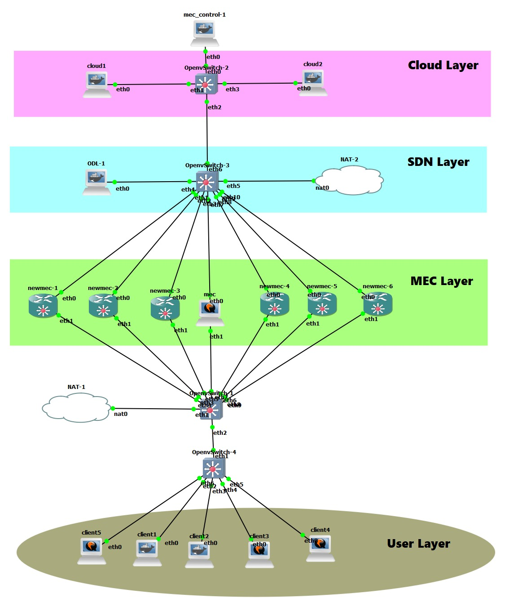
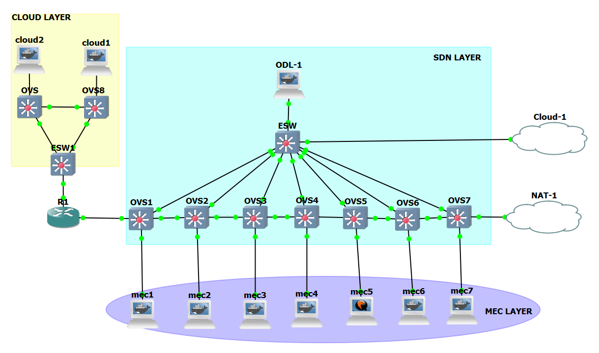
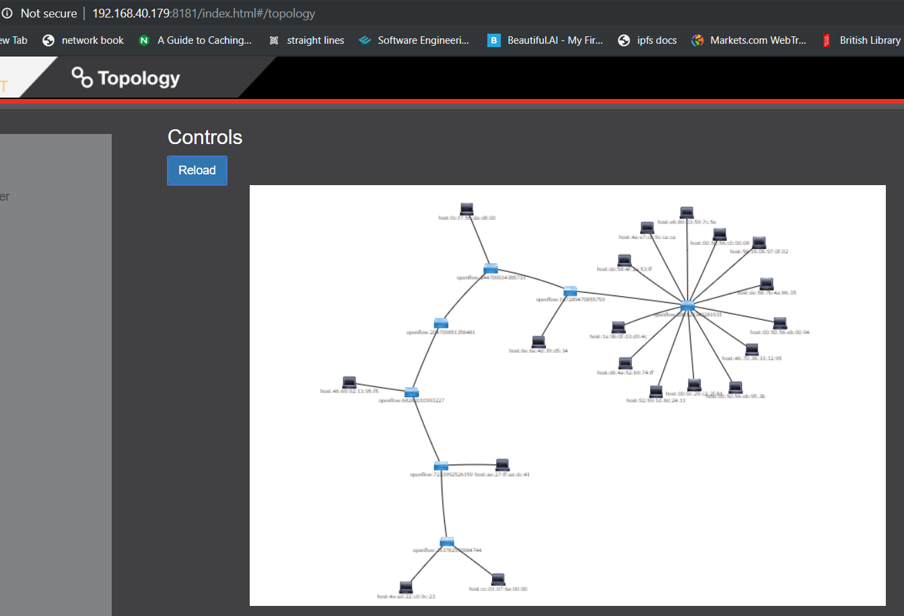

# Deadlock project for MEC

##### This is a property of London South Bank University licensed under the Creative Commons Attribution-NonCommercial-ShareAlike 4.0 International (CC BY-NC-SA 4.0)
##### Please get permission before use
@Author: Emeka Emmanuel Ugwuanyi ugwuanye@lsbu.ac.uk with contributions from Saptarshi Ghosh

### Note for self
` (((23**r.randrange(1, 1331)) % r.randrange(1, 1777)) % 5)`

### ssh setup
```bash
ssh-keygen -t rsa ; ssh-copy-id mec@192.168.122.110

```

#### SET UP Commands
```
apt update  
passwd   
password   
password   
apt install git sudo -y  
adduser mec  
password  
password  
usermod -aG sudo mec  
su - mec  
git clone https://github.com/emylincon/deadlock_project.git  
cd deadlock_project  
sudo bash set_up.sh  
password
```

## How To Use The System
##### Run instructions for heterogeneous environment
* The following are the steps for running and setup of the system. 
* The files for heterogenous are located in 2algo folder

###### GNS3 Heterogeneous Architecture 


###### SDN Architecture


###### Broker:
* start the mosquitto server first. 
* it is usually located on the first MEC node 
```bash
/etc/init.d/mosquitto start
```

###### cloud node:
* start the cloud nodes.
```bash
python3 deadlock_project/2algo/0_cloud.py
```
* then enter the brokers ip (ip address on eth0)


###### MEC nodes:
navigate to the MEC user. that is where the deadlock_project is sitting
```bash
cd /deadlock_project/2algo/
```
run any of the desired algorithm
* the speak .py runs only on the broker with is usually the first MEC
* the gui.py runs only on a gui not a server
* the NS.py runs on any other node

###### Live Result During Runtime


###### Clients:
* if the dns does not work for the client in ubuntu 18 run `sudo bash client_dns.sh`
* each client(o_gui_user.py) have a prepared data they have to read and run from {user3, user4 and user5}
* each correspond to a respective client node
* the corresponding python file have to be renamed to record.py in the user node.
* there are 3 official client/user files:
* 1.) 0.0_user.py : this is for the server 
* 2.) gui_user.py : this is for the desktop. it shows a live plot of the results obtained. Run this file if you dont want to use a predefined data. it automtically generates data using GG1 distribution
* 3.) o_gui_user.py : This is also to be used on a desktop because it shows a live plot of the result obtained. the difference between this and gui_user is that the this is used when you already have a predefined data. the data should be named record.py and placed on each of the client node


##### Run instructions for homogeneous environment
* The following are the steps for running and setup of the system. 
* The files for homogeneous are located in algo folder

###### cloud node:
* start the cloud nodes.
* run the setup.sh script to download necessary files for the algorithms to run
```bash
sudo bash setup.sh 
```
* first start the ssh server on the cloud node
* then run the python script.
```bash
python3 deadlock_project/algo/0_cloud.py
```


###### MEC nodes:
navigate to the MEC user. that is where the deadlock_project is sitting
```bash
cd /deadlock_project/algo/
```
* run the setup.sh script to download necessary files for the algorithms to run
```bash
sudo bash setup.sh 
```
* start ssh server
* run any of the desired algorithm
* the speak .py should be executed first
* the gui.py runs only on a gui not a server
* the NS.py runs on any other node
* all the files need a predefined distribution data to run except the files that have the letter 'n' just after the number
* the predefined data available in `deadlock_project/algo/Experiment` could be used
* the data available are labelled `data.py`, `data1.py`, `data2.py` and `data4.py`
* for any of these to be used, it has to be renamed to `data.py` and moved to the directory `deadlock_project/algo`

###### GNS3 Homogeneous Architecture 


###### SDN Architecture


##### Algorithms implemented
* RMS + Bankers
* EDF + Bankers
* RMS + Wound Wait
* RMS + Wait Die
* EDF + Wound Wait
* EDF + Wait Die


[Evolution of bankers algorithm](http://algorithm-wiki.org/wiki2/index.php?title=Banker%27s_algorithm)
